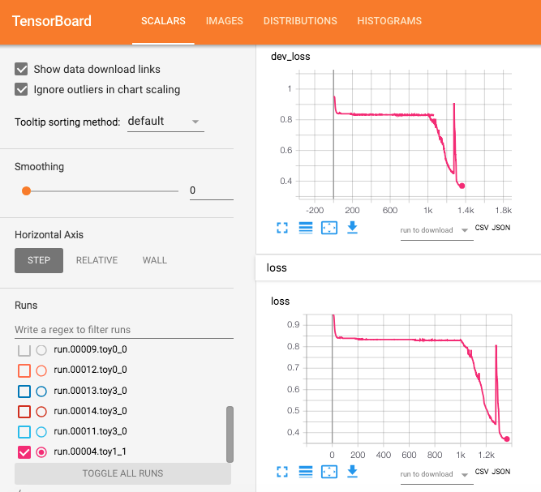
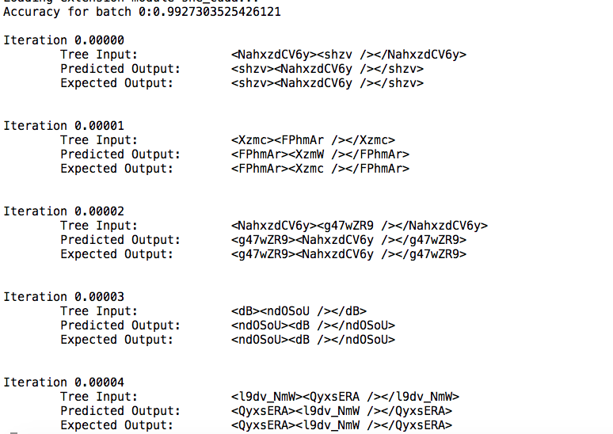

# Deep Learning Framework for XML 

This is a deep learning framework for operating on XML structured data. It is implemented in [PyTorch](http://pytorch.org). The framework has modularized and extensible
components for training, debugging, inference, checkpoints, model schema migrations etc. XML is the first class format for a large number of applications(All HTML web, office documents, SVG, etc).

In this release, we have implemented an equivalent of seq2seq. Given a set of input and output XMLs, the framework can automatic learn and then apply those transformations on novel XML inputs.

This is an alpha release. We appreciate any kind of feedback or contribution. In particular, we are looking for

1. New Application scenarios in your domain of interest.
2. Bug reports.
3. Code contributions. If you would join the project, please contact on the forum.

## Key Features 

1. Encoder decoder architecture.
2. Encoder designed to capture hierarchical structure of an XML.
   1. Tyipcal seq2seq models operate at a relatively small sentence length. Information flows linearly(unidirectional or bidirectional). Istead, XML data is hierarchical and requires information to flow along tree edges as well.
   2. Regular RNN for text and attributes of XML nodes.
   3. Inspired from [GraphRNN](https://arxiv.org/abs/1802.08773) for capturing structure of an XML tree. 
   4. Respects order of children of an XML element.
   5. Order not treated as important in XML attributes.
3. Decoder is designed to generate output XML. 
   1. Use of attention([1](https://arxiv.org/pdf/1502.03044.pdf), [2](https://arxiv.org/pdf/1706.03762.pdf)) to find the appropriate   character position or XML node or node attribute to focus upon.
   2. Use of pointer networks for learning to verbatim copy portions of text from input XML. 
   3. Custom GPU implementation of performance critical modules.
   4. Support for beam decoding during inference for better accuracy.
5. Use of [shortcut connections](https://datascience.stackexchange.com/questions/22118/why-do-we-need-for-shortcut-connections-to-build-residual-networks) between layers in the network for a more stable convergence.
6. Tensorboard integration(over pytorch tensors).
7. Schema versioning: We keep tweaking our models. We often need a way to migrate training done on our old model into new schema. This can be called a kind of "self-transfer learning. This is supported via schema versioning.

# Installation

This package supports Python 3.6. We recommend creating a new virtual environment for this project (using virtualenv or conda).  

### Prerequisites

* Install python and ninja. Use following commands on MacOS for installation using macports,
  $ sudo port install python36
  $ sudo port install py36-pip
  $ sudo port select --set pip pip36
  $ sudo port select --set python python36
  $ sudo port install ninja 

* Checkout the repository.
  git clone https://github.com/nishantsharma/xml.ai

* Install all python packages mentioned in requirements.txt. 
  $ sudo pip install -r requirements.txt

# Getting Started

## Datasets
Currently, we are running on generated datasets. There are 3 toy datasets that we support generating.

| S.No | Dataset ID | Description       | Input Example | Output Example| 
|------|------------|-------------------|---------------|---------------|
| 1.   | toy0       | Inverts node.text |  <toyrev>ldhmo</toyrev> |<toyrev>omhdl</toyrev> |
| 2.   | toy1       | Swaps parent and child node tags | <tag1><tag2 /></tag1> |<tag2><tag1 /></tag2> |
| 3.   | toy2       | Swapping shiping and billing address fields. | Data is compliant with schema.xsd. | Two addresses swapped. |
| 4.   | toy3       | Children order is reversed. <BR>Attribute list is rotated. <BR>Tail and text swapped. | &lt;a&gt;&lt;b p1="p1"&gt;&lt;/b&gt; &lt;c p2="p2"&gt;&lt;/c&gt;&lt;/a&gt; | &lt;a&gt;&lt;c p1="p1"&gt;&lt;/c&gt; &lt;b p2="p2"&gt;&lt;/b&gt;&lt;/a&gt; | 

### Preparing toy datasets
Run script to generate the reverse toy dataset.
By default, the generated data is stored in data/inputs/<domainId>.

    ./scripts/generate.sh --domain toy1
    ./scripts/generate.sh --domain toy2

To get help on generation parameters, give the following command.
    ./scripts/generate.sh --domain toy1 --help
    ./scripts/generate.sh --domain toy2 --help

### Training 
To continue last training run on the default domain. 
    ./scripts/train.sh

To continue last training run for a specific domain. 
    ./scripts/train.sh --domain toy1
    ./scripts/train.sh --domain toy2

For help.
    ./scripts/train.sh -h

### Evaluate a model 
To evalaute latest trained model of a domain. 
    ./scripts/evaluate.sh --domain <domainId>

To evaluate on domain toy1.
    ./scripts/evaluate.sh --domain toy1

For help.
    ./scripts/evaluate.sh -h

### Tensorboard
To view tensorboard logs, first make sure that tensorboard is already installed. 

    pip3 install tensorboard

Then, run the following command

    tensorboard --logdir ./data/training/runFolders/

### Checkpoints
Training checkpoints are organized by domainId, runNo, modelSchemaNo and function as shown in the following file structure.

    data/
      +-- training/
            +-- runFolders/
                  +-- run.<runNo>.<domainId>_<modelSchemaNo>/
                  +-- run.00000.toy1_0/
                        +-- Chk<epochNo>.<batchNo>/
                              +-- input_vocab*.pt
                              +-- output_vocab.pt
                              +-- model.pt
                              +-- modelArgs
                              +-- trainer_states.pt
      +-- testing/
            +-- runFolders/
                  +-- run.00000.toy1_0/
                        +-- Chk*/
                  +-- run.<runNo>.<domainId>_<modelSchemaNo>/
                        +-- Chk*/
      +-- inputs/
            +-- <domainId>/
                  +-- dev/
                        +-- dataIn*.xml
                        +-- dataOut*.xml
                  +-- test/
                        +-- dataIn*.xml
                        +-- dataOut*.xml
                  +-- train/
                        +-- dataIn*.xml
                        +-- dataOut*.xml

The sample script by default saves checkpoints in the `inputs/<domainId>` folder of the root directory. Look
at the usages of the sample code for more options, including resuming and loading from checkpoints.

## Some plots 

### Tensorboard integration with toy1


### Evaluating toy1 training

# Roadmap

The goal of this library is facilitating the development of XML-to-XML transformation techniques and applications.

## Application scenarios
We plan to bring following application scenarios to life.

1. Given a few XMLs, propose an XML schema that best describes them. It maybe a standard open schema.
2. XSLT Extractor: Given an input and output XML, generate the simplest XSLT which translates one to the other. Something like what [prose](https://microsoft.github.io/prose/) does.
3. Learn aesthetics transformations for common XML formats like SVG, PPT, DOC.
4. ...

## Model roadmap
We have following on our roadmap.

1. Currently, our decoder is generating output sequence and the learning process forces it to be XML. We want to directly generate output XML.
2. We are generating the complete training output as text. Instead, we want to generate XML transformations. Think XSLT to turn input XML to output XML.
3. We are operating at the supervised learning level. That may be good. But, imagine a scenario where a human is editing an XML(say his resume) for aesthetics. In that case, we can interpret aesthetics as an objective function. We would like to apply reinforcement learning to discover this underlying aesthetics objective function using reinforcement learning. One can use "Inverse Reinforment Learning" to discover the aesthetics objective function.

## Framework roadmap
While constantly improving the performnce, quality of code and documentation, we will also focus on the following items:

* Identification and evaluation with benchmarks;
* Provide more flexible model options, improving the usability of the library;
* Support features in the new versions of PyTorch.

# Troubleshoots and Contributing
If you have any questions, bug reports, and feature requests, please [open an issue](https://github.com/nishantsharma/xml.ai/issues/new) on Github.  For live discussions, please go to our [Gitter lobby](https://gitter.im/xml.ai/Lobby).

We appreciate any kind of feedback or contribution.  Feel free to proceed with small issues like bug fixes, documentation improvement.  For major contributions and new features, please discuss with the collaborators in corresponding issues.  

<!--
### Development Cycle
We are using 4-week release cycles, where during each cycle changes will be pushed to the `develop` branch and finally merge to the `master` branch at the end of each cycle.

### Development Environment
We setup the development environment using [Vagrant](https://www.vagrantup.com/).  Run `vagrant up` with our 'Vagrantfile' to get started.

The following tools are needed and installed in the development environment by default:
* Git
* Python
* Python packages: nose, mock, coverage, flake8

### Test
The quality and the maintainability of the project is ensured by comprehensive tests.  We encourage writing unit tests and integration tests when contributing new codes.

Locally please run `nosetests` in the package root directory to run unit tests.  We use TravisCI to require that a pull request has to pass all unit tests to be eligible to merge.  See [travis configuration](https://github.com/IBM/pytorch-seq2seq/blob/master/.travis.yml) for more information.

### Code Style
We follow [PEP8](https://www.python.org/dev/peps/pep-0008/) for code style.  Especially the style of docstrings is important to generate documentation.

* *Local*: Run the following commands in the package root directory
```
# Python syntax errors or undefined names
flake8 . --count --select=E901,E999,F821,F822,F823 --show-source --statistics
# Style checks
flake8 . --count --exit-zero --max-complexity=10 --max-line-length=127 --statistics
```
* *Github*: We use [Codacy](https://www.codacy.com) to check styles on pull requests and branches.
-->
